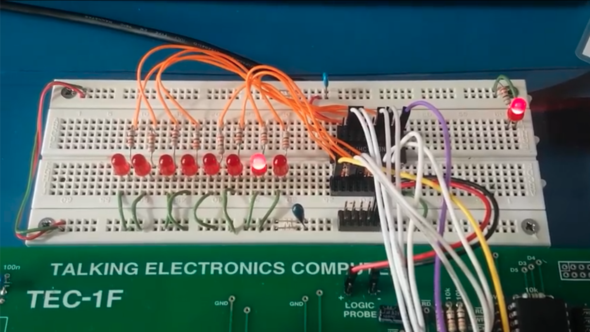

_Click the image to watch the video_
[](movie.mp4)

## Recipe 1: 8 LED light chaser

The problem to be solved is how to control a latched group of 8 LEDs to create a classic light chaser using MINT. In this case, the 8 LEDs are connected to a latch on port 3 of the TEC-1.


The first line is a comment

`\\\\back and forward LEDs`

In MINT, a comment starts with a \\\\ and continues all the way to the end of the line.

The first thing we need to do is write a user-defined command to take turn on the right most LED (and turn off all the others). We can do this by sending a hexadecimal `01` value to a latch on Port `3`.

Let's give this command an uppercase letter `D` as a name (you have 26 to choose from).

```
:​D #01 a! 7(a@ { a@#3\\O 2000()); \\\\ go left
```

The colon : indicates the start of a user command and must be immediately followed by `D` (no space). The definition continues until we reach the ;

Let's break this down further.

```
#01 a!
```

This means we initialise a variable `a` with 01. You have 26 general purpose variables named `a`..`z`, there are also more specialised variables `\\a`..`\\z` but we don't use those here.

Hexadecimal numbers in Mint are prefixed with `#`.  
So `#01 a !` means "take the value `#01` store it in the address of variable `a`"

Now that `a` contains `01` we can look at the next part

```
7(a@ { a! a@#3\\O 2000())
```

Parentheses `(` and `)` indicate that this is piece of repeated code, i.e. a loop. We want to repeat the code `a@ { a! a@#3\\O 2000()` and we want to repeat it 7 times.

Breaking down this repeated code further we see

```
a@ { a!
```

which means fetch the value stored in variable `a`, shift it left one bit and then store it again in variable a (the `{` is the shift left operator, `}` is the shift right operator)

```
a@#3\\O
```

Next we want to output the value of `a` to the latch connected to the TEC-1's output port 3. While spaces are nearly always optional, it might be clearer if we express this code as

```
a@ #3 \\O
```

which means "with the value of `a` and the port address `3` do an OUT operation. `\\O` (not to be confused with 0) means "output"

Finally we enter a delay `2000()` which is simply an empty loop iterated 2000 times. Based on our measurements of empty loops, each loop in MINT takes about 65 microseconds on a 4MHz Z80 so this delay would typically take around 1.2 seconds.

Now let's define a second user command in `E`

```
:E #80 a! 7(a@ } a@#3\\O 2000());
```

This works the same way as the definition `D` but goes in the opposite direction. `#80` represents having the left-most LED turned on and `}` means "shift it right" on each loop

Finally we bring these two commands together and repeat them over and over.

```
25(DE)
```

While there are ways to do infinite loops in MINT in this case we only want it to repeat 25 times.
