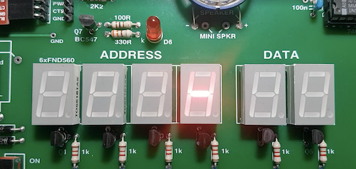

# Recipe 2: 6 digit display light chaser

## Problem

Light up a single segment of the TEC-1's 6 digit 7-segment display and create the impression of movement from right to left and back again.

## Hardware specifics

The TEC-1 controls its display using latches on two ports: the lower 6 bits (bits 0 - 5) of port 1 controls which digit of the 6 7-segment displays is illuminated. A 1 in bit 0 and all zeros in the other 5 illuminates the rightmost digit.

| Bit | digit   | byte |
| --- | ------- | ---- |
| 0   | digit 0 | #01  |
| 1   | digit 1 | #02  |
| 2   | digit 2 | #04  |
| 3   | digit 3 | #08  |
| 4   | digit 4 | #10  |
| 5   | digit 5 | #20  |
| 6   | serial  | #40  |
| 7   | N/A     | #80  |

One complication is that the bit-banged serial used by MINT on some hardware configurations need bit 6 (#40) to be kept high during the scanning so that random noise isn't transmitted to the serial terminal.

The eight bits of port 2 control the segments which are illuminated according to the scheme below:

| Bit | segment | desc         | byte |
| --- | ------- | ------------ | ---- |
| 0   | a       | top          | #01  |
| 1   | f       | top left     | #02  |
| 2   | g       | middle       | #04  |
| 3   | b       | top right    | #08  |
| 4   | dp      | point        | #10  |
| 5   | c       | bottom right | #20  |
| 6   | e       | bottom left  | #40  |
| 7   | d       | bottom       | #80  |

## Exercise 1 Move a segment rightwards and then leftwards

_Click the image to watch the video_
[](movie1.mp4)

At the beginning of the sequence, light up the middle segment of the leftmost digit. Move the lit segment to the digit to its right, repeat this movement all the way to the rightmost digit. Then make the reverse motion moving leftwards and returning the segment to its starting point.

Watch the video to see the effect of the segment appearing right and then left.

### Command R left to right

Write a command which moves the middle segment from the leftmost digit to the rightmost digit.

```
:R #04 2\O #20 a! 6( a@ #40| 1\O a@}a! 3500());
```

Where:

- `:R` declare a command called `R`
- `#04 2\O` turn on middle segment
- `#20` digit selection for leftmost digit
- `a!` save in variable `a`
- `6(` loop over the 6 digits
- `a@` fetch digit selector
- `#40|` ensure that bit 6 of the selector byte is high
- `1\O` output selector info to port 1
- `a@}a!` shift digit selector 1 bit right
- `3500()` delay approx. 0.3 seconds
- `)` end of loop
- `;` end of command declaration

### Command L right to left

Write a command which moves the middle segment from the rightmost digit to the leftmost digit.

```
:L #04 2\O #01 a! 6( a@ #40| 1\O a@{a! 3500());
```

Where:

- `:L` declare a command called `L`
- `#04 2\O` turn on middle segment
- `#01` digit selection for rightmost digit
- `a!` save in variable `a`
- `6(` loop over the 6 digits
- `a@` fetch digit selector
- `#40|` ensure that bit 6 of the selector byte is high
- `1\O` output selector info to port 1
- `a@{a!` shift digit selector 1 bit left
- `3500()` delay approx. 0.3 seconds
- `)` end of loop
- `;` end of command declaration

### Bringing it together

In a loop of 1000 times perform sequence R followed by sequence L

```
:I 1000(RL);
```

### Code for Exercise 1

```
:R #04 2\O #20 a! 6( a@ #40| 1\O a@}a! 3500());
:L #04 2\O #01 a! 6( a@ #40| 1\O a@{a! 3500());
:I 1000(RL);
```

Run code with command I

## Exercise 2 Circumnavigate the display

_Click the image to watch the video_
[](movie2.mp4)

Using the TEC-1's 6 digit 7-segment display create a light chaser in which one segment travels around the outer edge of the display. At the beginning of the sequence, light up the bottom segment of the leftmost digit. Move the lit segment to the digit to its right, then the following digit, all the way to the rightmost segment. Then make the lit segment move up the rightmost edge of the digit and then light up the top segment. Then move the lit segment through the digits to the left until it reaches the leftmost display again. Move down through the segments on the leftmost edge to return to the starting point. Watch the video to see the effect of the segment appearing to circumnavigate the display.

### Bottom segment moving right

Write a command which moves the bottom segment from the leftmost digit to the rightmost digit.

```
:E #80 2\O #20 a! 6( a@ #40| 1\O a@}a! 3500() );
```

Where:

- `:E` declare a command called `E`
- `#80 2\O` turn on bottom segment
- `#20` digit selection for leftmost digit
- `a!` save in variable `a`
- `6(` loop over the 6 digits
- `a@` fetch digit selector
- `#40|` ensure that bit 6 of the selector byte is high
- `1\O` output selector info to port 1
- `a@}a!` shift digit selector 1 bit right
- `3500()` delay approx. 0.3 seconds
- `)` end of loop
- `;` end of command declaration

### Right segment moving up

Write a command which moves from the bottom right segment to the top right segment.

```
:N #01 #40| 1\O #20 2\O 3500() #08 2\O 3500();
```

Where:

- `:N` declare a command called `N`
- `#01` select the rightmost digit
- `#40|` ensure that bit 6 of the selector byte is high
- `1\O` output selector info to port 1
- `#20 2\O` turn on the bottom right segment
- `3500()` delay approx. 0.3 seconds
- `#08 2\O` turn on the top right segment
- `3500()` delay approx. 0.3 seconds
- `;` end of command declaration

### Top segment moving left

Write a command which moves the top segment from the rightmost digit to the leftmost digit.

```
:W #01 2\O #01 a! 6( a@ #40| 1\O a@{a! 3500() );
```

Where:

- `:W` declare a command called `W`
- `#01 2\O` turn on top segment
- `#01` digit selection for rightmost digit
- `a!` save in variable `a`
- `6(` loop over the 6 digits
- `a@` fetch digit selector
- `#40|` ensure that bit 6 of the selector byte is high
- `1\O` output selector info to port 1
- `a@{a!` shift digit selector 1 bit left
- `3500()` delay approx. 0.3 seconds
- `)` end of loop
- `;` end of command declaration

### Left segment moving down

Write a command which moves from the top left segment to the bottom left segment.

```
:S #20 #40| 1\O #02 2\O 3500() #40 2\O 3500();
```

Where:

- `:S` declare a command called `S`
- `#20` select the leftmost digit
- `#40|` ensure that bit 6 of the selector byte is high
- `1\O` output selector info to port 1
- `#02 2\O` turn on the top left segment
- `3500()` delay approx. 0.3 seconds
- `#40 2\O` turn on the bottom left segment
- `3500()` delay approx. 0.3 seconds
- `;` end of command declaration

### Bringing it together

```
:J 1000(ENWS) ;
```

### Code for Exercise 2

```
:E #80 2\O #20 a! 6( a@ #40| 1\O a@}a! 3500());
:N #01 #40| 1\O #20 2\O 3500() #08 2\O 3500();
:W #01 2\O #01 a! 6( a@ #40| 1\O a@{a! 3500());
:S #20 #40| 1\O #02 2\O 3500() #40 2\O 3500();
:J 1000(ENWS) ;
```

Run code with command J
