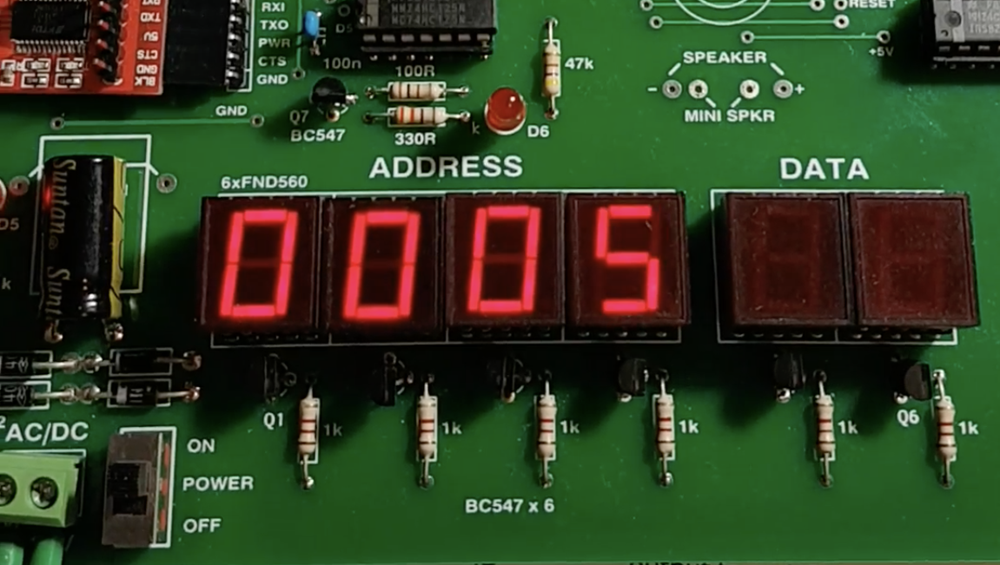

# Recipe 2: 4 digit counter

_Click the image to watch the video_
[](movie.mp4)

## The Problem

make a counter which counts up in hexadecimal from 0 to FFFF on the TEC-1's 7 segment display.

## The Solution

The TEC-1 controls it's 7-segment display with two ports 1 & 2.

- Port 1 (SCAN) that turns on one or more of the digits. Bit 0 turns on the rightmost digit. Bit 5 turns on the leftmost digit. One additional complication: we need to keep the 6th bit of Port 1 high at all times.
- Port 2 (DISPLAY) turns on and off segments and the decimal point of the currently active display(s).

The numbers we want to display only take 4 digits so we want to display them on digits 5 to 2 with digits 1 and 0 and turned off. The TEC-1 displays have to be cannot be controlled simultaneously. Each display needs to be activated in turn, first digit 0, then digit 1 etc in a scanning process. The speed this is done needs to be so rapid that it can't be perceived by the the human eye.

One extra complication: Bit 6 of port 1 need to be keep high at all times. This is to ensure that the bit-banged serial does not send any noise while running this program.

The numbers `0` - `F` are represented in 7 segments by the following table:

```
DB $EB $28 $CD $AD $2E $A7 $E7 $29 $EF $2F $6F $E6 $C3 $EC $C7 $47
```

The displays need to be scanned rapidly to prevent the perception of flickering. Every second or so the counter is incremented

## Byte array

The first step is to declare a nibble-to-7segments table as a one dimensional byte array

```
\[#EB #28 #CD #AD #2E #A7 #E7 #29 #EF #2F #6F #E6 #C3 #EC #C7 #47]' c!
```

- `\[` indicates that the numbers following are byte values which will be stored in a byte array allocated on the heap.
- `#EB` is an example of a hexadecimal byte value.
- `]` indicates the end of the array. This pushes the address of the array on the stack followed by its length.
- `'` we don't need the length so we drop it.
- `c!` we store the 16-bit address of the array in the variable `c` so we can access it later.

## Definition A: convert a nibble to 7 segment display representation

```
value -- DISPLAY
```

Write a definition which takes a value in the lower 4 bits 0 - F and converts it to 7 segment display representation

```
:A #0F& c@+ \@;
```

Where:

- `:A` declare a definition called A
- `#0F&` bitwise-AND the top of the stack with the hexadecimal value 0F, this mask everything except the bottom 4 bits
- `c@+` get the address of the byte array and add it to the masked nibble value, this is the address of the 7 segment value
- `\@` read a byte from the address
- `;` end of definition

## Definition B: output a nibble to an active digit

Write a definition which takes a 16-bit number value and an 8-bit value representing the currently active digit. We are only interested in the lowest 4 bit of the number value. The digit is selected by a 1 in Bit 5 to Bit 0. Bit 6 is kept at 1 at all times.

```
number scan --
```

```
:B $ A 2\O #40 | 1\O 10() #40 1\O;
```

Where:

- `:B` declare a definition called B
- `$` swap `number` with `scan`
- `A` convert the lower 4 bits of `number` into 7 segment representation
- `2\O` write the 7 segments data out to Port 2 (DISPLAY)
- `#40 |` bitwise-OR `scan` value with hex 40 to keep bit 6 high
- `1\O` write digit selector value to Port 1 (SCAN)
- `10()` delay for about half a millisecond
- `#40` output all 0s to the digits but bit 6 kept high
- `1\O` write digit selector value to Port 1 (SCAN)
- `;` end of definition


## Definition C: scan number to display

Take a 16-bit number and display it on the upper 4 7-segment displays.

```
number --
```

```
:C #04 4( %%B {$ }}}}$ ) '' ;
```

Where:

- `:C` declare a definition called C
- `#04` push the first digit to scan, 4 is the third-last digit
- `4(` start a loop which will iterate 4 times
- `%%` duplicate the top two stack items
- `B` output the lowest 4 bits of number to active segment
- `{` shift `scan` to one bit to left
- `$` swap `number` to top of stack
- `}}}}` shift `number` one nibble right
- `$` swap new `scan` to top of stack
- `)` end loop
- `''` drop the top two stack items
- `;` end of definition

## Count and display

This is the entry point of the program

Count up from zero 

Create a loop for counting up from 0 to FFFF. Inside this loop add another loop which which scans the displays 100 times before moving on. We use the loop counter variable \j@ to access the value of the outer loops variable. We pass that value to command E.

To run type:

```
:E #FFFF( 100( \j@ C ) 0 0B ;
```

Where:

- `:E` declare a definition called E
- `#FFFF(` loop FFFF times
- `100(`
- `\j@` read the value of _outer_ loop variable `j`
- `E` scan number to display
- `)` end of inner loop
- `)` end of outer loop
- `0 0B` turn off Ports 1 & 2 but keeping bit 6 of Port 1 high
- `;` end of definition

## Complete listing

```
:A #0F& c@+ \@;
:B $ A 2\O #40 | 1\O 10() #40 1\O;
:C #04 4( %%B {$ }}}}$ ) '' ;
:E #FFFF( 100( \j@ C ) 0 0B ;
```

